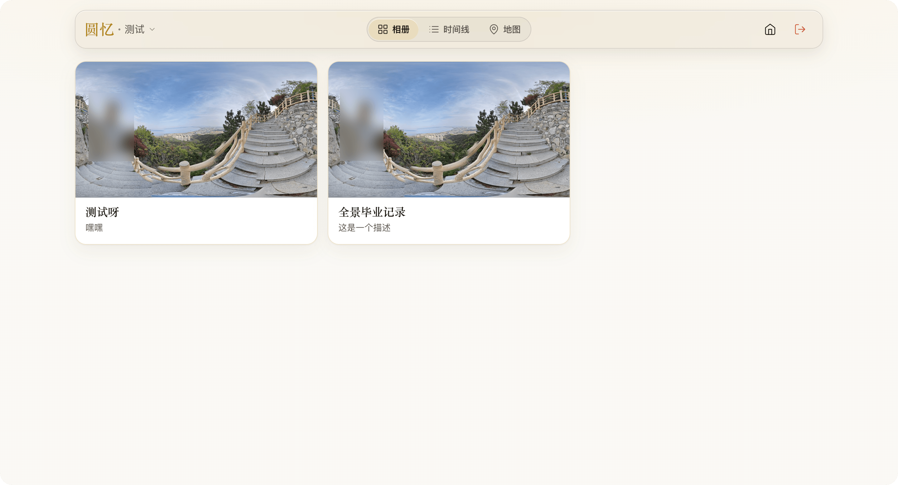
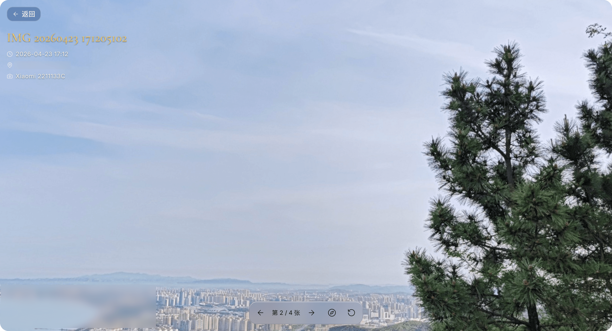
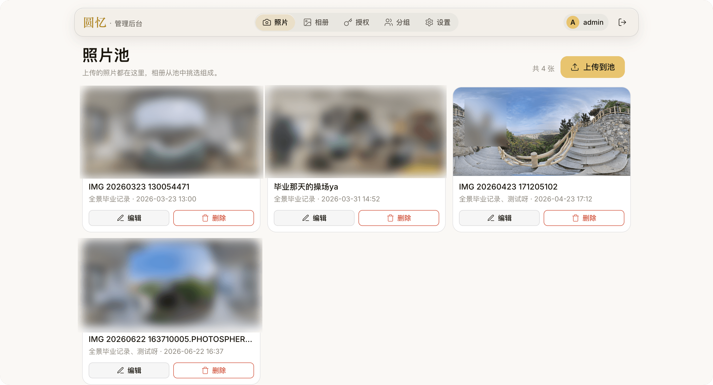
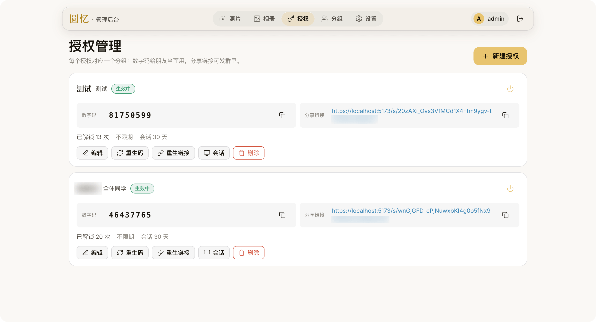

# 圆忆 RoundMemo

一个用于整理和分享 360° 全景照片的自托管相册。

照片可以先上传到照片池，再整理到不同相册和分组中。分组可以生成分享链接和数字口令，家人或朋友无需登录即可查看。支持全景查看器、拍摄地点地图、备份恢复等功能。

[English](README.en.md) | [简体中文](README.md)

[](https://github.com/VenenoSix24/RoundMemo/actions/workflows/ci.yml)


## 特性

- **照片池**：照片统一存放在照片池中，可以添加到多个相册；从相册移除不会删除原图
- **相册与分组**：相册可以绑定到分组，分组通过分享链接 + 数字口令访问
- **分享控制**：支持开关分享、设置有效期、访问次数上限，以及让指定设备下线
- **全景查看器**：支持 equirectangular 全景照片，提供拖拽、滚轮、捏合和手机陀螺仪控制
- **查看器效果**：支持自动旋转和小行星开场动画，打开照片时可以从小行星视角展开到全景
- **照片信息**：按拍摄时间倒序排列，显示拍摄时间和地点；标题、描述和地点名称会显示在查看器中
- **地图**：根据照片 GPS 位置生成地图标记并自动聚类，支持高德地图、OpenStreetMap 和自定义瓦片源
- **备份恢复**：支持生成单文件 `.rmbackup` 备份，也提供系统层全量备份脚本
- **自托管**：后端为单个 Go 二进制，配合 systemd 和 Caddy 部署

## 界面预览

<table>
  <tr>
    <td></td>
    <td></td>
  </tr>
  <tr>
    <td align="center">访客端 · 相册列表</td>
    <td align="center">访客端 · 全景查看</td>
  </tr>
  <tr>
    <td></td>
    <td></td>
  </tr>
  <tr>
    <td align="center">管理端 · 照片池</td>
    <td align="center">管理端 · 分享页</td>
  </tr>
</table>


## 技术栈

- **后端**：Go、chi、SQLite
- **数据库**：SQLite，使用 modernc，无 CGO 依赖
- **前端**：Vite、TypeScript、Three.js、Leaflet
- **部署**：systemd + Caddy

## 本地开发

依赖：

- Go ≥ 1.26
- Node.js ≥ 20

### 后端

在 `server/` 目录中运行：

```bash
cp ../config.example.toml ../config.toml
go run ./cmd/roundmemo -config ../config.toml
```

### 前端

```bash
cd web
npm ci
npm run dev
```

`storage.data_dir` 默认相对于当前工作目录解析。如果从其他目录启动服务，请在 `config.toml` 中使用绝对路径。

本地使用 `http://127.0.0.1` 调试时，将：

```toml
secure_cookies = false
```

否则浏览器会拒绝 HTTP 下的 Secure Cookie。

### 创建 Owner

首次使用时，在 `server/` 目录运行：

```bash
go run ./cmd/roundmemo -config ../config.toml owner create <用户名>
```

## 部署

项目提供安装脚本，可以在轻量 VPS 上完成部署：

```bash
sudo bash deploy/install.sh --domain pano.example.com
```

安装脚本会引导配置，也可以通过参数跳过部分交互。

| 参数 | 说明 |
| --- | --- |
| `--domain <域>` | 对外域名，同时设置 `public_base_url` |
| `--data-dir <路径>` | 数据目录，默认 `/opt/roundmemo/data` |
| `--listen <地址>` | 服务监听地址，默认 `127.0.0.1:8787` |
| `--no-caddy` | 只安装二进制和 systemd，跳过 Caddy |
| `--dry-run` | 只显示将执行的操作，不修改系统 |
| `--yes` | 跳过交互确认，需要同时提供必要参数 |

安装过程：

1. 编译后端二进制和前端 `dist`
2. 安装到 `/opt/roundmemo/`
3. 创建 `roundmemo` 系统用户
4. 首次安装时生成 `config.toml`
5. 安装 systemd unit 并启动服务
6. 配置 Caddy，并通过 Let's Encrypt 自动申请 HTTPS

如果重新运行安装脚本：

- 已存在的 `config.toml` 不会被覆盖
- 进入升级流程
- 更新二进制、前端 `dist` 和 systemd unit
- 旧二进制和 `dist` 各保留一份 `.bak`

创建 Owner：

```bash
sudo -u roundmemo /opt/roundmemo/roundmemo owner create <用户名>
```

安装脚本不会自动安装 Go、Node.js 或 Caddy。如果缺少依赖，会显示对应的安装命令并退出。

## 备份与恢复

### 系统备份

`deploy/backup.sh` 会创建完整备份，包括：

- SQLite 一致性快照
- 原图
- 缩略图
- 图片签名密钥

例如：

```bash
bash deploy/backup.sh --dest /var/backups/roundmemo --keep 7
```

可以配合 cron 定期运行，并将备份同步到其他服务器保存。

### 应用内备份

Owner 后台的「备份恢复」页面可以生成 `.rmbackup` 文件。

备份可以直接下载，也可以在另一台机器上恢复，用于迁移整个 RoundMemo 实例。

## 配置

主要配置位于 `config.toml`。

| 配置项 | 说明 |
| --- | --- |
| `server.listen` | 服务监听地址，Caddy 默认反代到这里 |
| `server.public_base_url` | 对外访问地址，用于生成分享链接 |
| `server.secure_cookies` | HTTPS 环境设为 `true`；本地 HTTP 调试设为 `false` |
| `storage.data_dir` | 数据目录，包含原图、缩略图和数据库 |
| `security.code_rate_per_hour` | 数字口令尝试限制，每个 IP 每小时允许的次数 |
| `security.session_ttl_days` | 访客会话有效期 |
| `security.admin_session_ttl_days` | Owner 会话有效期 |
| `security.img_sig_ttl_seconds` | 图片签名有效期 |

## 路线图

### v1.2.0

已实现：

- 照片池
- 相册和分组授权
- 全景查看器
- 地图视图
- 备份恢复
- 后台管理
- 液态玻璃界面
- 陀螺仪控制
- 自动旋转
- 小行星开场动画

### 规划中

- S3 兼容对象存储
- 桌面端 / 移动端

### 长期

- 静态文件加密
- 查看器高分辨率分块 LOD
- 多实例部署

## 工程规范

- Conventional Commits
- GitHub Flow
- CI 检查 `gofmt`、`go vet`、`go test`、`go build`
- 前端进行 TypeScript 类型检查和 Vite 构建

## License

RoundMemo 使用 [AGPL-3.0](LICENSE)。
